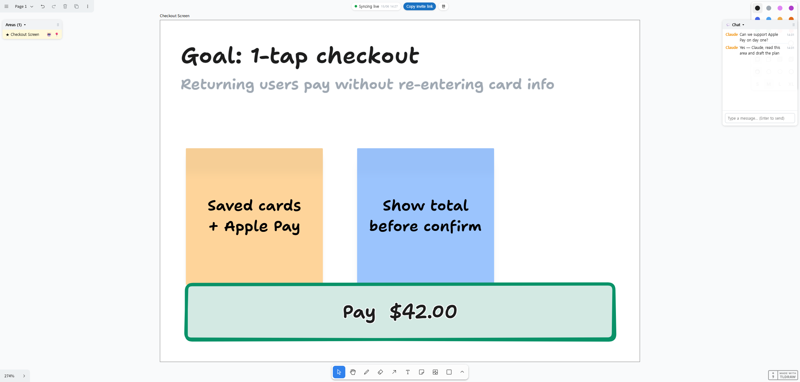

# canvas-forge

**English** · [한국어](README.ko.md)

> An infinite-canvas board where a team plans together — and when you attach Claude, the plan gets built.

People sketch ideas freely on an endless canvas with text, images, and drawings. The host marks one area and calls Claude; Claude reads that area, turns it into a structured plan ("Is this right?"), and on approval actually builds it. **Without Claude it's a planning tool; attach Claude and it's a planning + building tool.**

- Serverless / host-invited / non-commercial — the host opens the board on their own machine and invites people; data stays local to the host.
- Claude attaches over **MCP**.



## Quick start

```bash
npm install
npm run build          # build the front end (the tldraw board) into dist/
npm run host           # start the single host process (default port 4317, override with PORT)
```

1. Open `http://localhost:4317` in a browser → enter a name and the infinite canvas appears. The top badge shows sync status, and the board auto-reconnects if you restart the host. Use the **EN / 한** toggle (top-right) to switch the interface language.
2. **Invite**: the host console prints a real invite link (e.g. `http://192.168.0.95:4317`). You can also use the **"Copy invite link"** button at the top of the board. Anyone on the same network opens that link, types a name, and edits the same board live (with multi-cursors and name tags). ※ If the first connection fails, check that Windows Firewall allows it.
3. Register the MCP server with Claude Code:
   ```bash
   claude mcp add --transport http canvas-forge http://localhost:4317/mcp
   ```
4. Draw a **frame** on the board and give it a title (= one area, shortcut **F**). Place text and drawings inside the frame. In the **Areas panel** (draggable) you can click to jump to an area, drop a 📍 location pin, and use the **🤖 button to mark an area as "for Claude to read" (★)**.
5. Drop **anything** into a frame — text and drawings, of course, but also images (png/jpg/gif/webp/svg), text files and **PDFs** (→ 📄 file card), pasted URLs (bookmarks with auto title/thumbnail), embedded **web pages as iframes** via the Insert Embed menu (if a site blocks framing you'll get a blank frame — use a bookmark instead), and **videos** (mp4/webm). Claude reads all of it.
6. **Curate videos with comments** — select a video and the comment panel appears. Turn on "⏱ Tag current playback time" and add a comment (like a `1:23` timestamp in a YouTube comment); Claude then pulls **just that frame + the comment context** for analysis. Click a time chip to seek there. Comments are shared with all participants in real time.
7. **Chat** — send a message from the **💬 chat panel** (right side) and ① it **accumulates in the panel** (the server keeps it in `.board/chat.json`, so late-joiners still see the history) and ② a **speech bubble** appears above the sender's cursor and fades after a few seconds. The panel can collapse/expand (showing an unread count while collapsed) and be dragged around.
8. Call it from a Claude Code session: "look at the board" (★-marked areas first) or "read the 'Checkout Screen' area" → `read_area` reads the area as **multimodal** content (text in chronological order with `[14:05 guest]` labels + a screenshot + original images + file contents + PDFs + link bodies + tagged video frames) → `post_card` posts an "is this right?" card that **shows up live for every participant** → once the host approves, Claude builds it with Claude Code's own tools. Claude understands the discussion as a timeline (when a later opinion overrides an earlier one, the latest wins).

Data lives in the host's local `.board/` (board.json + exports + uploads) and is restored after you close and reopen. Posting cards (`post_card`) and reading area text work even with no browser tab open.

### Development

```bash
npm run dev:web        # vite dev server (front end only, HMR) — note: MCP/persistence run under `npm run host`
npm test               # server tests (vitest): board persistence / area extraction / MCP e2e
```

## Status

✅ **MVP1 working** — the Claude bridge loop (mark area → `read_area` → `post_card` → approve → build). Verified end-to-end in a real browser.
✅ **MVP2 working** — real-time collaboration: N concurrent users, multi-cursors, host-hub sync (`@tldraw/sync`). Verified with two real browser tabs (host + guest).
✅ **MVP3a working** — multimodal reading: individual original images, text file cards, link unfurl + body reading.
✅ **MVP3b working** — PDF text extraction, web-page iframe embeds, area panel / location pins, and **MCP server instructions** (usage rules delivered automatically to the attaching Claude).
✅ **MVP3c (video) working** — video comments + time-tag curation: Claude analyzes only the moments people flagged via comments, as frame + context (no ffmpeg — captured in the browser). Headless verification: tagged-moment frame pixels confirmed.
✅ **Collaboration UX** — chat panel (accumulating, persisted history, cursor bubbles), area ★-marking (Claude prioritizes them), chronological reading (`[HH:MM author]` — understanding the flow of discussion), draggable panels. Interface available in English and Korean (EN / 한 toggle).

Roadmap: ~~MVP1~~ → ~~MVP2~~ → ~~MVP3a~~ → ~~MVP3b~~ → ~~MVP3c (video)~~ → remaining: cross-project bookmarks.

Spec: [`docs/spec.md`](docs/spec.md) · Design: [`docs/superpowers/specs/2026-06-09-canvas-forge-design.md`](docs/superpowers/specs/2026-06-09-canvas-forge-design.md), [`MVP2`](docs/superpowers/specs/2026-06-10-mvp2-realtime-collab-design.md)

## Architecture

- **Front end**: React + tldraw + Vite. Infinite canvas, text/image/drawing objects, frames, and area selection all come from tldraw.
- **Host local server**: Node. Persists board state (`.board/board.json`), exports images, and exposes the MCP server. A browser alone can't reach local files or Claude Code, so this server is the bridge.
- **MCP server** (the interface Claude attaches to): `list_areas` / `read_area(area_id)` (multimodal: text + screenshot) / `post_card(area_id, markdown)`.
- **Area = a tldraw frame.** The host draws a frame and titles it — that's one area. There is no separate partitioning system.

## Operating model

Serverless / host-invited / non-commercial. No central server, no auth, no billing — the host opens a board on their own machine and invites people. Data stays on the host's machine.

> **Intended limitation (not a bug):** with no auth and a `0.0.0.0` bind, anyone invited on the LAN can connect (by design — non-commercial, host-invited). Static serving and uploads only block path traversal. Remote (over-the-internet) access requires the host to set up their own tunnel / port forwarding.
